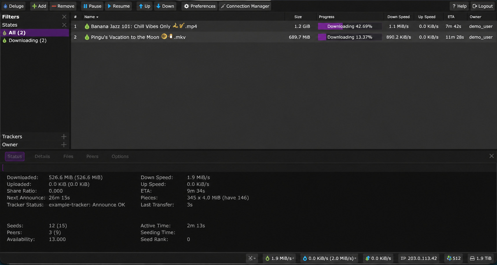
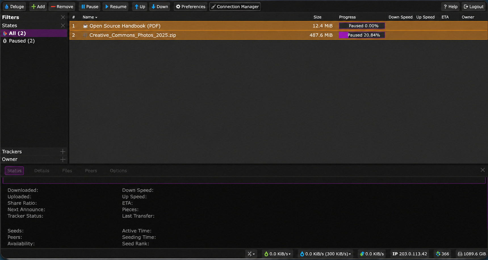

<h1 align="center">🎬 Torrentflix</h1>

<p align="center"><b>Download it. Stream it. Own it.</b></p>
<p align="center">A small self-hosted Docker stack with Deluge, Plex and secure Nginx HTTPS access.</p>

Torrentflix is for people who want to watch films, courses and other media on
their own server, download files with magnet links or torrent files, and keep
their data under their control.

- Deluge downloads files in an isolated container with a dark WebUI.
- Plex streams a library on a VPS or Home Server.
- Downloads can use local storage or an existing NAS mount.
- Local mode runs Deluge on macOS/Linux and can be removed afterwards.
- BitTorrent peer ports are never published on the host by the installer.

## Screenshots

Click a preview to open the full-size image.

<table>
  <tr>
    <td align="center" width="50%"><a href="docs/images/deluge_exmpl_1.jpg"></a><br><sub>Deluge WebUI</sub></td>
    <td align="center" width="50%"><a href="docs/images/deluge_exmpl_2.jpg"></a><br><sub>Dark theme</sub></td>
  </tr>
</table>

## Choose your scenario

| You want to... | Choose | What you get |
|---|---|---|
| Download from anywhere | **VPS (Public Server)** | Deluge behind HTTPS, bundled Nginx and Let's Encrypt |
| Download at home | **Home Server (LAN Only)** | Deluge available on the LAN, no domain or public Nginx |
| Download temporarily on a computer | **Local (macOS/Linux)** | Deluge on `localhost:8112`, no Plex, no root |
| Stream your library | **Plex on VPS/Home Server** | Plex with local or NAS-mounted read-only media |

## Quick start

Requirements: Docker Engine with Compose on Linux, or Docker Desktop on
macOS. The installer also uses `curl`, `tar` and `openssl`.

```bash
git clone https://github.com/m0nokey/torrentflix.git
cd torrentflix
./run.sh
```

The menu asks for the host type first:

```text
1. VPS (Public Server)
2. Home Server (LAN Only)
3. Local (macOS/Linux)
```

VPS and Home Server are Linux server installations and require `sudo ./run.sh`.
Local mode runs as the normal user and installs Deluge only. UID/GID, runtime
directories and ownership are detected automatically; the user does not enter
technical Docker IDs or create `/opt` directories manually.

If Docker denies access to `/var/run/docker.sock`, configure that separately.
Membership in the `docker` group is effectively root-equivalent on the host:

```bash
sudo usermod -aG docker "$USER"
newgrp docker
docker info
```

If Docker is not running:

```bash
sudo systemctl enable --now docker
```

## Service choices

### Deluge

- VPS asks for one hostname, for example `deluge.example.com`, and serves the
  WebUI at `https://deluge.example.com/deluge/`.
- Home Server serves the WebUI at `http://SERVER_IP:8112`.
- Local serves the WebUI at `http://localhost:8112`.
- A strong random WebUI password is generated and printed once at the end.
- Deluge's BitTorrent peer traffic stays Docker-internal; no `6881` host port
  is opened or requested.

### Plex

Plex is available only in VPS and Home Server modes. The installer optionally
accepts a short-lived claim token without echoing it. Without one, it prints
an SSH tunnel for first-time headless setup.

For media, the installer offers detected mounts, a user-entered existing path,
or a Torrentflix-managed fallback. Existing NAS or external media paths are
never `chown`ed, `chmod`ed or deleted. Plex mounts media read-only by default.

## Runtime layout

The Git checkout is never used as persistent application data.

### VPS and Home Server

```text
/opt/torrentflix/deluge/
    compose.yml                # Home Server runtime
    compose.vps.yml            # VPS runtime
    .env
    config/
    secrets/
    downloads/                  # default managed downloads
    nginx/                      # VPS only

/opt/torrentflix/plex/
    compose.yml
    .env
    config/
    transcode/
    media/                      # only managed fallback media
```

Server services use deterministic identities independent of the SSH user:

```text
media group  10000
Deluge       10001:10000
Plex         10002:10000
```

If an ID is already used, the installer chooses a free one and stores it in
the service `.env` for future updates. It does not create host accounts.

### Local macOS/Linux

```text
Git checkout: anywhere

Linux runtime:
    ~/.local/share/torrentflix/deluge/
macOS runtime:
    ~/Library/Application Support/Torrentflix/deluge/
Downloads:
    ~/Downloads/torrentflix-downloads/
```

Local Deluge inherits the real local user's UID/GID. If the script is
accidentally started through `sudo`, it resolves the invoking user's home and
identity instead of creating root-owned files in that home. Plex is not part
of Local mode.

## Networking model

```text
VPS:
    Internet → Nginx HTTPS → Deluge WebUI

Home Server:
    LAN → host:8112 → Deluge WebUI

Local:
    localhost:8112 → Deluge WebUI

All modes:
    BitTorrent peer traffic → Docker internal network only
```

In VPS mode Deluge `8112` is not published on the host. The installer performs
its WebUI health check and password/theme bootstrap from the Docker network.
The bundled Nginx ACME state is stored in its named Docker volume.

## NAS storage

Mount SMB/CIFS or NFS on the Docker host and enter that mount path when the
installer asks for downloads or Plex media. Do not mount the NAS from inside a
container.

Example SMB entry with fictional values:

```fstab
//192.0.2.50/media /mnt/downloads cifs vers=3.1.1,username=media-user,password=ChangeThisExamplePassword,iocharset=utf8,file_mode=0770,dir_mode=0770,noperm,_netdev,x-systemd.automount 0 0
```

Example NFS entry with fictional values:

```fstab
192.0.2.60:/export/media /mnt/media nfs4 rw,_netdev,noatime,x-systemd.automount,x-systemd.requires=network-online.target 0 0
```

For a VPS without a mount, completed files can be sent to a home server:

```bash
rsync -a --partial --append-verify --remove-source-files --info=progress2 \
  /opt/torrentflix/deluge/downloads/completed/ \
  user@home-server:/srv/media/completed/
find /opt/torrentflix/deluge/downloads/completed -type d -empty -delete
```

Only use `--remove-source-files` after confirming the files no longer need to
seed.

## Uninstall and data safety

The menu includes uninstall. Configuration is removed by default while
downloads and media are preserved. Removing managed downloads requires typing
`DELETE` exactly. Invalid menu choices and confirmations are requested again.
External download and media paths are never removed.

The installer uses exact allowlisted paths, `.torrentflix-managed` marker files
and overlap checks. It refuses dangerous targets such as `/`, `$HOME`, the
Git checkout, `/opt`, `/mnt` and their broad parent directories.

## Technical security notes

Torrent clients parse torrent files, magnet metadata, tracker responses and
data supplied by peers. Historically, torrent clients have had vulnerabilities
in WebUIs, URL/certificate handling, input parsing and filesystem handling.
Docker isolation does not make untrusted downloads automatically safe, but it
reduces the filesystem and privilege impact of a compromised process.

Torrentflix uses pinned Deluge and Plex image digests, a theme pinned to an
upstream commit with SHA-256 verification, random WebUI credentials, a
read-only Deluge root filesystem, reduced capabilities and resource limits.
Plex intentionally keeps host networking for discovery and compatibility, so
it is less isolated than Deluge; Plex is not made read-only because it needs to
write its database, cache and transcode data.

This project is intentionally not an *arr stack: it does not automatically
search, rename, import or orchestrate media through Sonarr/Radarr/Prowlarr.

## Dependency maintenance

Dependency updates are maintained automatically by Renovate. Docker images stay
pinned to immutable version-and-digest references, and GitHub Actions stay
pinned to full commit SHAs. Digest, patch and minor updates are tested by CI
and may be merged automatically after a short release-age cooldown. Major
updates require review.

The installer never resolves `latest` or searches for dependencies at runtime.
The scheduled maintenance workflow also checks the pinned Deluge theme commit
and SHA-256, then opens a normal pull request when the upstream artifact
changes.

The CI workflow has three stable checks:

```text
validate → build → smoke
```

The `smoke` check starts Deluge, the VPS Nginx-to-Deluge stack and Plex, then
checks their minimum HTTP readiness and container stability. Configure
`validate`, `build` and `smoke` as required checks in the `main` branch ruleset.
Renovate must pass the same checks and must not bypass the ruleset.

## Credits and license notes

The dark WebUI theme is created and maintained by [Joelacus](https://github.com/joelacus)
in the [deluge-web-dark-theme](https://github.com/joelacus/deluge-web-dark-theme)
repository. It is distributed under GPLv3. See
[THIRD-PARTY-NOTICES.md](THIRD-PARTY-NOTICES.md).
